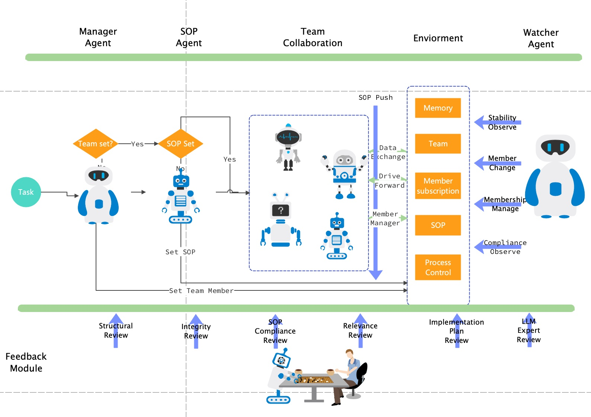

# AIEvo: 蚂蚁集团开源的多智能体框架

---

## 介绍

AIEVO 是 **蚂蚁集团** 开源的一个 **多智能体** 框架，通过该框架，可以高效的创建一个多智能体应用

## 核心优势

- **Sop高度遵从性**: 可以严格遵从任务的SopGraph去执行一个复杂任务
- **高执行成功率**: 通过feedback和watcher机制，来提高了复杂任务的执行成功率
- **高度灵活性**: 支持根据任务属性，动态的创建任务和设置订阅关系
- **可扩展性**: 预留大量扩展点，方便用于对框架的自定义增强
- **企业生产验证**: 经过了蚂蚁集团内部的生产验证，验证了框架的稳定性和可靠性

## 使用示例

### 多智能体示例

- [辩论赛](/examples/multi-agent-example/battle): 多智能体之间完成一场辩论赛
- [狼人杀](/examples/multi-agent-example/werewolf): 多智能体之间完成一场狼人杀游戏
- [谁是卧底](/examples/multi-agent-example/undercover): 多智能体之间完成一场谁是卧底游戏
- [论文编写](/examples/multi-agent-example/paper_write): 多智能体协作完成论文写作

### 单智能体示例

- [工程师](/examples/single-agent-example/engineer): 一个能够完成代码编写任务的工程师

## 架构概览



## 模块介绍

### Agent模块

该模块的主要功能是用于Agent的构建，我们使用ReAct的方式进行Agent的构建，相比于使用LangChain构建Agent，我们支持和别的Agent进行自主交互

以创建一个程序员Agent为例:
```go
// 实例化基座模型
client, _ = openai.New(
    openai.WithToken(os.Getenv("OPENAI_API_KEY")),
    openai.WithModel(os.Getenv("OPENAI_MODEL")),
    openai.WithBaseURL(os.Getenv("OPENAI_BASE_URL")))
// 文件操作相关工具
fileTools, _ := file.GetFileRelatedTools(workspace)
// 命令执行
bashTool, _ := bash.New()
// 构建工具集
engineerTools := make([]tool.Tool, 0)
engineerTools = append(engineerTools, fileTools...)
engineerTools = append(engineerTools, bashTool)
// 回调处理器，主要用于分析Agent的执行过程
callbackHandler := &CallbackHandler{}
// 定义Env，用于和其他Agent进行交互以及记忆存储
env := environment.NewEnv()
env.Memory = memory.NewBufferMemory()
// 构建Agent
engineer, _ := agent.NewBaseAgent( 
    // Agent的名称 
    agent.WithName("engineer"),
    // Agent的描述 
    agent.WithDesc(EngineerDescription),
    // Agent的Prompt（支持设置动态参数）
    agent.WithPrompt(EngineerPrompt),
    // Agent的指令（支持设置动态参数）
    agent.WithInstruction(SingleAgentInstructions),
    // Agent的动态参数
	// 1. 当前工作流程
    agent.WithVars("sop", Workflow),
	// 2. 当前工作区
    agent.WithVars("workspace", workspace),
    // Agent的工具集
    agent.WithTools(engineerTools),
    // Agent的基座模型
    agent.WithLLM(client),
    // Agent的回调处理器
    agent.WithCallback(callbackHandler),
	// Agent的环境
    aievo.WithEnvironment(env),
)

// 运行Agent
gen, _ := engineer.Run(
    context.Background(), 
	// 用户消息
    []schema.Message
    {
        {
            Type:     schema.MsgTypeMsg,
            Content:  "写一个终端版本的贪吃蛇",
            Sender:   "User",
            Receiver: "engineer",
        },
    }, 
	// 基座模型参数
    llm.WithTemperature(0.1)
)

// 打印Agent的回复
fmt.Println(gen.Messages[0].Content)
```

### Env模块

在多智能体中，该模块主要用于存储: 团队成员、订阅关系、历史消息、任务的SopGraph等信息，该模块也是Agent之间交互的中转池，Agent会将消息发送到Env中，由驱动模块分发到对应的Agent

下面是Env模块的接口定义
```go
type Environment interface {
	// Produce 生产消息
	Produce(ctx context.Context, msgs ...Message) error
	// Consume 消费消息
	Consume(ctx context.Context) *Message
	// SOP 获取任务的SopGraph
	SOP() string
	// GetTeam 获取团队里面的所有Agent
	GetTeam() []Agent
	// GetTeamLeader 获取团队Leader
	GetTeamLeader() Agent
	// LoadMemory 获取Agent的历史消息
	LoadMemory(ctx context.Context, receiver Agent) []Message
	// GetSubscribeAgents 获取某个Agent的订阅者
	GetSubscribeAgents(_ context.Context, subscribed Agent) []Agent
}
```

除了存储上面的基本信息之外，Env模块还可以存储一些控制信息，比如token(任务最大消耗token)、max_turns(Agent最大运行次数)等信息

既然提到Env是消息的中转池，下面我们来详细介绍下AIEvo中的Message

下面是Message的结构体定义
```go
type Message struct {
	// 消息类型
	Type      string       `json:"cate"`
	// 产出该消息的思考过程
	Thought   string       `json:"thought"`
	// 消息内容
	Content   string       `json:"content"`
	// 发送方
	Sender    string       `json:"sender"`
	// 接收方
	Receiver  string       `json:"receiver"`
	// 接受条件
	Condition string       `json:"condition"`
	// 生成该消息过程中的工具调用记录
	Steps     []StepAction `json:"steps"`
	// 相关日志存储
	Log       string
	// 用于Team中Agent的增加和删除
    MngInfo    *MngInfo
	// 所有的可以接收该消息的Agent
	AllReceiver []string
}
```

目前的支持的消息类型有:
1. MsgTypeMsg: 常规交互信息
2. MsgTypeEnd: 会话结束信息
3. MsgTypeCreative: CreativeAgent创建Team时产生的信息
4. MsgTypeSOP: SopAgent根据任务生成SopGraph时产生的信息

不同的消息投递到Env中的处理策略不同:
- MsgTypeMsg -> msgStrategy: 将消息存到Memory中
- MsgTypeCreative -> creativeStrategy: 对Team进行变更(用于剔除和更新agent)
- MsgTypeSOP -> sopStrategy: 将SopGraph存到Env中

目前支持的团队模式有:
1. DefaultSubMode: 默认模式，存在LeaderAgent时，使用LeaderSubMode，否则使用ALLSubMode
2. LeaderSubMode: 所有Agent都只订阅LeaderAgent，同时LeaderAgent订阅所有Agent，由LeaderAgent推动整个任务的执行
3. ALLSubMode: 所有Agent都互相订阅，大家一起推动任务的执行
4. CustomSubMode: 自定义订阅关系，由用户自己指定订阅关系

> 如何选择团队模式?
> - LeaderSubMode: 适用于任务Sop比较复杂，且对于任务成功率要求比较高的场景
> - ALLSubMode: 适用于任务Sop相对简单，想要充分发挥Agent的自主性的场景
> - CustomSubMode: 适用于Agent之间的订阅关系相当明确，且Sop相对简单的场景

### Feedback模块

该模块用于对Agent生成的内容进行审查和反馈

在没有该模块之前，可能存在如下问题:
1. 没有按照固定的格式生成内容
2. 由于LLM的幻觉，导致Agent对某一个工具重复调用
3. 任务的推进消息，没有按照SopGraph来进行
4. 生成的回复中包含敏感信息

在引入Feedback之后，便可以解决上述问题，例如：在Feedback中，我们可以对输出的消息格式进行校验，如果满足要求，则给出建议，然后进行重试

当然需要用到Feedback的场景远不止如此，用户可以自定义所需要的Feedback

Feedback的接口定义:
```go
type Feedback interface {
	Feedback(ctx context.Context, agent schema.Agent, messages []schema.Message, actions []schema.StepAction,
		steps []schema.StepAction, prompt string) *FeedbackInfo
}
```
FeedbackInfo结构体定义:
```go
type FeedbackInfo struct {
	// 反馈类型: 通过/不通过
	Type  FeedbackType `json:"type"`
	// 反馈建议
	Msg   string       `json:"msg"`
	// 消耗的Token
	Token int          `json:"token"`
}
```

多个Feedback可以组成如下的FeedbackChain:
```go
// feedbackChain Define a struct contains slice of Feedback
type feedbackChain struct {
	chains []Feedback
}

// Feedback Implement the Feedback method for the feedbackChain
func (fc *feedbackChain) Feedback(ctx context.Context, agent schema.Agent, messages []schema.Message, actions []schema.StepAction,
	steps []schema.StepAction, prompt string) *FeedbackInfo {

	info := &FeedbackInfo{
		Type: Approved,
	}

	for _, feedback := range fc.chains {
		if feedback == nil {
			continue
		}
		info = feedback.Feedback(ctx, agent, messages, actions, steps, prompt)
		if info.Type == NotApproved {
			return info
		}
	}

	return info
}

// Chain function to create a new Feedback that chains multiple Feedback
func Chain(chains ...Feedback) Feedback {
	return &feedbackChain{chains: chains}
}
```

### Watcher模块

该模块用于监控整个多智能体的运行情况，在适当的时候，介入到运行过程中

例如: 在狼人杀场景中，某一个Agent被杀，watcher会将该Agent从Team中移除，避免后续还收到消息，扰乱整个运行过程

watcher的运作过程如下:

1. 开启一个 watcher 观察所有的执行流程，并生成Team变更消息，用于剔除和更新agent
    ```go
    func (e *AIEvo) Watch(ctx context.Context, _ string, opts ...llm.GenerateOption) (string, error) {
        if e.Watcher != nil {
            e.WatchChan = make(chan schema.Message)
            e.WatchChanDone = make(chan struct{})
            go func() {
                for message := range e.WatchChan {
                    if e.WatchCondition != nil && e.WatchCondition(message) == false {
                        e.WatchChanDone <- struct{}{}
                        continue
                    }
                    generation, err := e.Watcher.Run(ctx, e.LoadMemory(ctx, e.Watcher))
                    if err != nil {
                        e.WatchChanDone <- struct{}{}
                        continue
                    }
                    e.UpdateCost(generation.TotalTokens)
                    e.Produce(ctx, generation.Messages...)
                    e.WatchChanDone <- struct{}{}
                }
            }()
        }
        return "", nil
    }
    ```

2. 实施变更消息
   ```go
   func (e *Environment) mngInfoStrategy(ctx context.Context, msg *schema.Message) error {
       if msg.MngInfo == nil {
           return nil
       }
       // 当前仅支持移除
       if msg.MngInfo.Remove != nil {
           e.Team.RemoveMembers(msg.MngInfo.Remove)
       }
       _ = e.Memory.Save(ctx, *msg)
       return nil
   }
   ```

### 驱动模块

该模块用于驱动整个多智能体运行，整个驱动逻辑是以消息来驱动的

整个运行步骤如下:
```go
e.Handler = Chain(e.BuildPlan, e.BuildSOP, e.Watch, e.Scheduler)
```
1. 构建Team(可以手动指定): 根据当前的任务属性构建Team
2. 构建Sop(可以手动指定): 根据任务文档构建Sop
3. 启动Watcher: 启动Watcher观察整个运行过程
4. 开始调度: 根据Env中的消息调度各个Agent

调度逻辑如下:

```go
func (e *AIEvo) Scheduler(ctx context.Context, prompt string, opts ...llm.GenerateOption) (string, error) {
	// 首先由用户消息进行驱动
	e.Produce(ctx, schema.Message{
		Type:     schema.MsgTypeMsg,
		Content:  prompt,
		Sender:   _defaultSender,
		Receiver: e.Leader.Name(),
	})
	// 循环从Env中消费消息，直到消息为空
	for msg := e.Consume(ctx); msg != nil; msg = e.Consume(ctx) {
		if msg.IsEnd() {
			return msg.Content, nil
		}
		// 获取消息的接受者
		receivers := msg.Receivers()
		for _, rec := range receivers {
			receiver := e.Agent(rec)
			if receiver == nil {
				if len(receivers) == 1 {
					return msg.Content, fmt.Errorf(
						"get unexcept agent %s", msg.Receiver)
				}
				continue
			}
			messages := e.LoadMemory(ctx, receiver)
			if e.Callback != nil {
				e.Callback.HandleAgentStart(ctx, receiver, messages)
			}
			// 调度对应的Agent运行
			gen, err := receiver.Run(ctx, messages, opts...)
			if err != nil {
				return "", err
			}
			if e.Callback != nil {
				e.Callback.HandleAgentEnd(ctx, receiver, gen)
			}

			if gen.Messages == nil {
				return "", fmt.Errorf("gen messages is nil for agent %s", msg.Receiver)
			}

			gen.Messages[0].Token = gen.TotalTokens
			// 将消息投递到Env中
			e.Produce(ctx, gen.Messages...)
			e.broadcast(gen.Messages...)
		}
	}
	return "", nil
}
```

## 交流

- 钉钉群：21765030887

  

- 微信公众号：AIEvo多智能体


## License

AIEvo 遵循 Apache 2.0 许可证，详细内容请阅读 [LICENSE]()